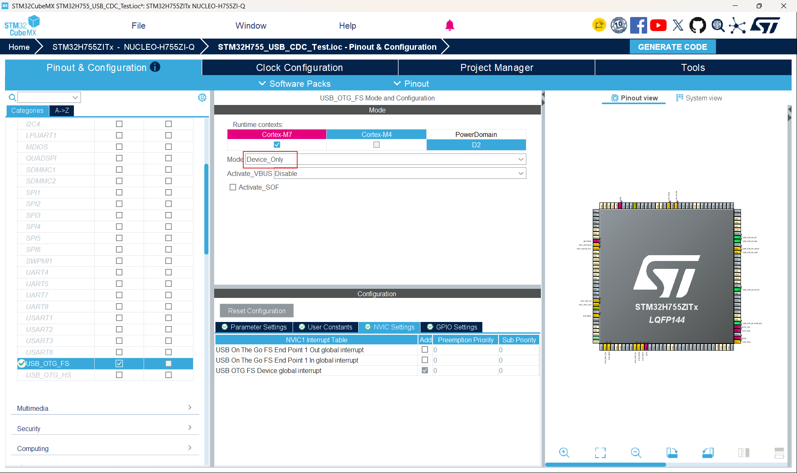
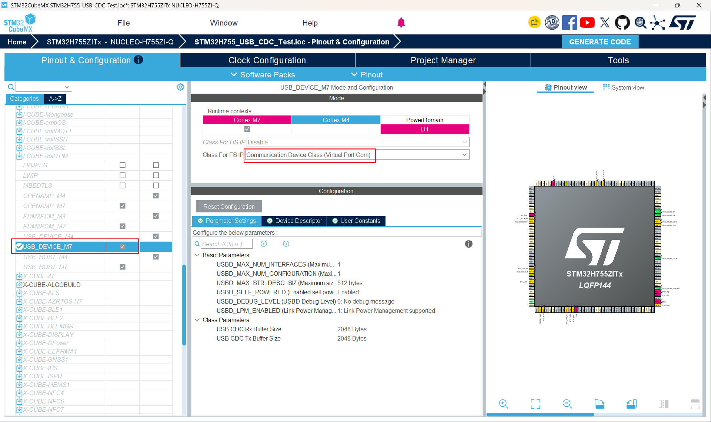
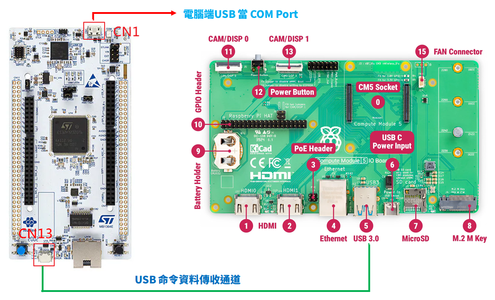
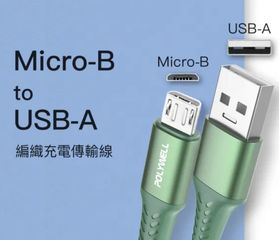

# STM32H755 USB CDC ACM Command Test

## 1. 專案目的

本專案用於建立與驗證：

```text
Raspberry Pi CM5 ↔ STM32H755
```

之間的 **USB CDC ACM 雙向 Command 通訊**。

本專案是正式系統整合之前的獨立 Bring-Up / Proof-of-Concept 測試。

目前已成功驗證：

```text
CM5
 │
 │ USB
 │ USB CDC ACM
 ▼
STM32H755
```

可以完成：

```text
CM5 → STM32H755
Command

STM32H755 → CM5
Response
```

目前測試 Command：

```text
MOV R 1000 1000 500 0 0 0\r\n
```

STM32H755 正確接收、累積、解析 Command 後回傳：

```text
DONE\r\n
```

CM5 最終收到：

```text
Response: DONE
```

---

# 2. 整體系統背景

STM32H755 USB CDC ACM 並不是整個系統唯一的通訊介面。

最終系統架構為：

```text
                           End User
                               │
                               │ TCP/IP
                               ▼
                    ┌─────────────────────┐
                    │ Raspberry Pi CM5    │
                    │                     │
                    │ TCP Server          │
                    │ Command Parser      │
                    │ USB Transport       │
                    └──────────┬──────────┘
                               │
                               │ USB CDC ACM
                               ▼
                    ┌─────────────────────┐
                    │ STM32H755           │
                    │                     │
                    │ Command Processing  │
                    │                     │
                    │ SPI1 → EtherCAT     │
                    │ SPI2 → CM5          │
                    └─────────────────────┘
```

其中：

### USB CDC ACM

負責：

```text
CM5 → STM32H755
```

的 Command 通訊，以及：

```text
STM32H755 → CM5
```

的 Response。

### SPI2

SPI2 是另一條獨立的資料通道，主要負責後續即時 EtherCAT / motion trajectory data 傳送。

因此：

> USB Command Transport 與 SPI2 即時資料 Transport 是兩條不同的通道，不應混合設計。

---

# 3. 為什麼先做 USB 獨立測試？

正式系統預計：

```text
Windows TCP Client
        ↓
CM5 TCP Server
        ↓
Command Parser
        ↓
USB CDC ACM
        ↓
STM32H755
```

如果直接一次整合所有模組，發生錯誤時很難判斷問題來自：

* TCP Client
* TCP Server
* Command Parser
* CM5 USB Transport
* Linux TTY
* USB CDC
* STM32 Command Parser

因此先建立最小測試：

```text
CM5
 │
 │ USB CDC ACM
 ▼
STM32H755
```

先證明 USB Transport 本身可靠。

---

# 4. 硬體

## 4.1 MCU

```text
STM32H755ZIT6U
```

開發板：

```text
NUCLEO-H755ZI-Q
```

使用：

```text
CM7 Core
```

執行本 USB Device 測試。

---

# 5. USB 架構

STM32H755 使用：

```text
USB_OTG_FS
```

設定為：

```text
USB Device
```

USB Class：

```text
CDC
```

Linux CM5 端則使用：

```text
USB CDC ACM
```

因此完整資料鏈：

```text
STM32 USB CDC Device
        │
        │ USB
        ▼
Linux USB CDC ACM Driver
        │
        ▼
/dev/ttyACM0
```

---

# 6. CubeMX USB 設定

本專案的 USB Device 是透過 STM32CubeMX / STM32CubeIDE 產生。

## 6.1 USB Peripheral

啟用：

```text
USB_OTG_FS
```

模式：

```text
Device Only
```

---

## 6.2 USB Class

在 USB Device Middleware 中啟用：

```text
CDC
```

即：

```text
USB_DEVICE
    └── CDC
```

---

# 7. USB Clock

USB Full-Speed 必須使用正確的：

```text
48 MHz
```

本專案使用：

```text
HSI48
```

作為 USB Clock Source。

因此需要確保：

```text
HSI48 = 48 MHz
```

並讓 USB Peripheral 使用正確的 48 MHz Clock。

---

# 8. USB GPIO 設定

本專案使用 USB OTG FS：

```text
PA8
PA9
PA11
PA12
```

相關 Alternate Function：

```text
AF10_OTG1_FS
```

USB 資料線：

```text
PA11 → USB_DM
PA12 → USB_DP
```

PA8 / PA9 則依 MCU / USB OTG FS 的 CubeMX configuration 使用。

---

# 9. USB Device Configuration

目前產生的 `usbd_conf.c` 中，USB Device 使用：

```text
PCD_SPEED_FULL
```

也就是：

```text
USB Full Speed
```

---

## 9.1 DMA

本測試：

```text
DMA Enable = DISABLE
```

也就是：

```text
dma_enable = DISABLE
```

目前 USB Bring-Up 不使用 DMA。

---

## 9.2 PHY

使用：

```text
PCD_PHY_EMBEDDED
```

也就是 MCU 內建 USB PHY。

---

## 9.3 VBUS sensing

目前：

```text
vbus_sensing_enable = DISABLE
```

---

# 10. STM32 Cube 產生的主要檔案

USB Device Middleware 產生的主要檔案包括：

```text
CM7/
├── USB_DEVICE/
│   ├── App/
│   │   ├── usb_device.c
│   │   ├── usbd_cdc_if.c
│   │   └── usbd_cdc_if.h
│   │
│   └── Target/
│       ├── usbd_conf.c
│       └── usbd_conf.h
```

實際專案中請依 CubeMX 產生的目錄結構為準。

---

# 11. `main.c` 初始化

USB Device 初始化由 CubeMX 產生：

```c
MX_USB_DEVICE_Init();
```

因此系統啟動流程包含：

```text
main()
 │
 ├── HAL initialization
 │
 ├── System Clock
 │
 ├── GPIO
 │
 ├── USB Device initialization
 │
 └── Main loop
```

USB Device 初始化完成後，STM32 就可以等待 USB Host，也就是 Raspberry Pi CM5 的連線。

---

# 12. Raspberry Pi CM5 端的 USB Device

STM32 插入 CM5 後，Linux 會辨識為：

```text
/dev/ttyACM0
```

USB Device 資訊曾確認：

```text
VID:PID
0483:5740
```

Model：

```text
STM32_Virtual_ComPort
```

因此：

```text
STM32H755
    ↓
USB CDC Device
    ↓
Linux
    ↓
cdc_acm driver
    ↓
/dev/ttyACM0
```

這一步是 USB Bring-Up 的第一個成功條件。

---

# 13. CM5 端測試程式

CM5 建立獨立專案：

```text
~/usb_command_test
```

主要結構：

```text
usb_command_test/
├── CMakeLists.txt
├── include/
│   └── usb_transport.hpp
└── src/
    ├── main.cpp
    └── usb_transport.cpp
```

CM5 端建立：

```cpp
class UsbTransport
```

負責：

```text
open()
close()
sendCommand()
receiveResponse()
```

---

# 14. CM5 `open()` 的重要設定

最初 CM5 端只使用：

```cpp
open(
    "/dev/ttyACM0",
    O_RDWR | O_NOCTTY
);
```

後來發現 Linux TTY 狀態會影響傳送的 CR/LF。

因此正式版本的 `UsbTransport::open()` 必須自行設定 `termios`。

使用：

```cpp
#include <termios.h>
```

並：

```cpp
tcgetattr()
cfmakeraw()
cfsetispeed()
cfsetospeed()
tcsetattr()
```

建立固定的 TTY environment。

目前使用：

```text
115200
8 data bits
No parity
1 stop bit
No hardware flow control
Raw mode
```

注意：

> USB CDC ACM 並不是傳統 UART，因此這裡的 115200 並不是 USB 實體傳輸速率。它主要是建立一致的 Linux TTY configuration。

---

# 15. CM5 Command

目前測試 Command：

```text
MOV R 1000 1000 500 0 0 0\r\n
```

完整資料長度：

```text
27 bytes
```

其中：

```text
Command body = 25 bytes
CRLF         = 2 bytes
Total        = 27 bytes
```

---

# 16. STM32 `CDC_Receive_FS()`

STM32 的主要 Command Receive callback：

```c
static int8_t CDC_Receive_FS(
    uint8_t* Buf,
    uint32_t *Len
)
```

USB CDC 收到資料時，會進入：

```text
CDC_Receive_FS()
```

---

# 17. 不可以假設一次 callback 就是一個 Command

這是本專案非常重要的設計結論。

例如一個：

```text
27 bytes
```

的 Command，STM32 實際可能收到：

```text
第一次：
26 bytes

第二次：
2 bytes
```

因此：

```text
一次 write()
≠
一次 CDC_Receive_FS()
```

USB CDC callback boundary 不等於 Application Protocol boundary。

---

# 18. Command Buffer

因此 STM32 使用：

```c
static char command_buffer[128];
static uint32_t command_length = 0U;
```

收到 USB 資料後：

```text
Buf
 ↓
command_buffer
 ↓
command_length
```

持續累積。

---

# 19. CRLF 作為 Command 結束條件

目前 Application Protocol 使用：

```text
\r\n
```

作為 Command terminator。

STM32 會檢查：

```c
if ((command_length >= 2U) &&
    (command_buffer[command_length - 2U] == '\r') &&
    (command_buffer[command_length - 1U] == '\n'))
```

一旦偵測：

```text
CRLF
```

表示：

```text
完整 Command 已經收到
```

然後交給 Command Parser。

---

# 20. Command body 與 CRLF 分離

目前測試 Command：

```text
MOV R 1000 1000 500 0 0 0\r\n
```

收到：

```text
27 bytes
```

其中：

```text
27 - 2 = 25
```

因此比較：

```text
25 bytes Command body
```

而不是把 CRLF 包含在 Command body 中。

---

# 21. Command Content Validation

目前 Bring-Up 測試暫時使用固定 Command：

```c
static const char expected_command[] =
    "MOV R 1000 1000 500 0 0 0";
```

取得：

```c
const uint32_t expected_length =
    sizeof(expected_command) - 1U;
```

然後：

```c
memcmp(
    command_buffer,
    expected_command,
    expected_length
)
```

確認收到的 Command。

這只是 USB Bring-Up 用的測試 Parser。

正式產品版本將替換成真正的 Command Parser。

---

# 22. STM32 Response

Command 正確後，STM32 回傳：

```c
uint8_t response[] = "DONE\r\n";
```

並呼叫：

```c
CDC_Transmit_FS(
    response,
    sizeof(response) - 1U
);
```

因此實際 Response：

```text
DONE\r\n
```

---

# 23. `CDC_Transmit_FS()`

目前使用 CubeMX CDC interface 提供的：

```c
CDC_Transmit_FS()
```

其內部會先確認：

```c
hcdc->TxState
```

如果目前 USB TX busy：

```c
return USBD_BUSY;
```

否則：

```c
USBD_CDC_SetTxBuffer()
USBD_CDC_TransmitPacket()
```

開始傳送。

這表示未來正式產品如果需要高頻率或大量 Response，必須進一步處理：

```text
USBD_BUSY
```

以及 TX queue。

目前 Bring-Up Test 尚不需要複雜化。

---

# 24. 第一次發現的 `\r` 問題

本專案除了一般 USB Bring-Up，也發現一個非常重要的 Linux TTY 問題。

原本 STM32 應該收到：

```text
...\r\n
```

但實際 Debug 發現：

```text
...\r\r\n
```

HEX：

```text
0D 0D 0A
```

也就是多了一個：

```text
0D
```

即：

```text
\r
```

---

# 25. 問題的初步懷疑

檢查 CM5：

```bash
stty -F /dev/ttyACM0 -a
```

發現：

```text
onlcr
```

存在。

因此初步懷疑 Linux TTY output processing 可能將：

```text
\n
```

轉換為：

```text
\r\n
```

而 Application 原本已經傳：

```text
\r\n
```

就可能形成：

```text
\r\r\n
```

---

# 26. 第一次除錯方法

嘗試：

```bash
stty -F /dev/ttyACM0 -opost
```

確認：

```text
-opost
```

確實存在。

但是再次測試，STM32 仍然收到：

```text
0D 0D 0A
```

因此：

> 單純依靠 Shell 中的 `stty -opost` 不是可靠的正式解決方案。

---

# 27. 找到真正的工程問題

進一步檢查 CM5 的：

```text
usb_transport.cpp
```

發現原始：

```cpp
UsbTransport::open()
```

只負責：

```cpp
open("/dev/ttyACM0", O_RDWR | O_NOCTTY)
```

卻沒有自行設定：

```text
termios
```

因此 USB Transport 實際上依賴：

```text
當時 Linux TTY 的狀態
```

這是一個不應該存在的隱性 dependency。

---

# 28. 正式解決方法

CM5 `UsbTransport::open()` 改為：

```cpp
struct termios tty;

tcgetattr(fd_, &tty);

cfmakeraw(&tty);

cfsetispeed(&tty, B115200);
cfsetospeed(&tty, B115200);

tty.c_cflag |= (CLOCAL | CREAD);
tty.c_cflag &= ~CSTOPB;
tty.c_cflag &= ~CRTSCTS;
tty.c_cflag &= ~PARENB;
tty.c_cflag &= ~CSIZE;
tty.c_cflag |= CS8;

tcsetattr(fd_, TCSANOW, &tty);
```

核心是：

```cpp
cfmakeraw(&tty);
```

讓 USB Transport 使用 raw TTY mode。

---

# 29. 修正前後比較

## 修正前

Application：

```text
MOV R 1000 1000 500 0 0 0\r\n
```

STM32：

```text
... 0D 0D 0A
```

也就是：

```text
\r\r\n
```

結果：

```text
Command length / framing
受到干擾
```

---

## 修正後

Application：

```text
MOV R 1000 1000 500 0 0 0\r\n
```

STM32：

```text
... 0D 0A
```

也就是：

```text
\r\n
```

結果：

```text
command_length = 27
received_command_length = 25
expected_length = 25
```

完全正確。

---

# 30. 最終 CM5 → STM32 測試結果

STM32 COM3：

```text
[USB RX] Len=27
[USB RX] Data HEX:
4D 4F 56 20 52 20 31 30 30 30 20 31 30 30 30 20
35 30 30 20 30 20 30 20 30 0D 0A

[USB RX] CRLF detected, command_length=27
[USB RX] expected_length=25, received_command_length=25
```

這證明 STM32 收到的資料為：

```text
MOV R 1000 1000 500 0 0 0\r\n
```

沒有多出的：

```text
\r
```

---

# 31. 最終 STM32 → CM5 測試結果

STM32 回傳：

```text
DONE\r\n
```

CM5：

```text
Command sent
Response: DONE
```

因此雙向通訊：

```text
CM5 → STM32
        PASS

STM32 → CM5
        PASS
```

---

# 32. 完整測試資料流程

```text
┌──────────────────────────────────────────┐
│ Raspberry Pi CM5                         │
│                                          │
│ main.cpp                                 │
│     │                                    │
│     ▼                                    │
│ UsbTransport::sendCommand()              │
│     │                                    │
│     ▼                                    │
│ write(/dev/ttyACM0)                      │
│     │                                    │
│     ▼                                    │
│ Linux CDC ACM                            │
└───────────────┬──────────────────────────┘
                │ USB
                ▼
┌──────────────────────────────────────────┐
│ STM32H755                                │
│                                          │
│ USB CDC                                  │
│     │                                    │
│     ▼                                    │
│ CDC_Receive_FS()                         │
│     │                                    │
│     ▼                                    │
│ command_buffer                           │
│     │                                    │
│     ▼                                    │
│ CRLF detection                           │
│     │                                    │
│     ▼                                    │
│ Command Parser                           │
│     │                                    │
│     ▼                                    │
│ CDC_Transmit_FS()                        │
└───────────────┬──────────────────────────┘
                │ USB
                ▼
┌──────────────────────────────────────────┐
│ Raspberry Pi CM5                         │
│                                          │
│ /dev/ttyACM0                             │
│     │                                    │
│     ▼                                    │
│ UsbTransport::receiveResponse()          │
│     │                                    │
│     ▼                                    │
│ Response: DONE                           │
└──────────────────────────────────────────┘
```

---

# 33. 本專案的重要工程結論

## 33.1 USB CDC Callback 不等於 Application Packet

永遠不要假設：

```text
write()
=
CDC_Receive_FS()
```

Command 必須透過 Application Layer framing 組合。

---

## 33.2 CRLF 是 Application Protocol 的一部分

目前 Command Protocol 使用：

```text
CRLF = \r\n
```

因此 Transport Layer 必須保持 byte transparency。

---

## 33.3 CM5 TTY 必須由 Transport 自己設定

不能要求使用者先執行：

```bash
stty -F /dev/ttyACM0 -opost
```

Transport 應自行：

```text
open
 ↓
termios
 ↓
raw mode
 ↓
communication
```

這樣才能避免環境依賴。

---

## 33.4 USB 與 SPI2 不應混合

本 USB 通道：

```text
Command / Response
```

SPI2：

```text
Real-time trajectory data
```

兩者具有不同的用途與時間特性。

---

# 34. 目前測試限制

目前 STM32 程式是 Bring-Up Test，因此尚未完成正式 Command System。

目前：

```text
Command = 固定測試 Command
Response = 固定 DONE\r\n
```

尚未加入完整：

* Command syntax parser
* Parameter validation
* Command queue
* Timeout handling
* Invalid command response
* Multiple command processing
* USB disconnect/reconnect handling
* TX queue
* `USBD_BUSY` retry mechanism
* 長時間壓力測試

這些應留到正式 Command Parser 階段處理。

---

# 35. 與 CM5 `usb_command_test` 的關係

CM5 端：

```text
usb_command_test
```

負責驗證：

```text
Linux
USB CDC ACM
/dev/ttyACM0
UsbTransport
Command TX
Response RX
```

STM32 端：

```text
STM32H755 USB CDC Command Test
```

負責驗證：

```text
USB Device
CDC
CDC_Receive_FS()
Command Buffer
CRLF detection
Command parsing
CDC_Transmit_FS()
```

兩邊組合起來：

```text
CM5 usb_command_test
        │
        │ USB CDC ACM
        ▼
STM32H755 USB CDC Test
```

共同完成完整的 End-to-End Test。

---

# 36. 最終驗證項目

| 項目                         | 結果       |
| -------------------------- | -------- |
| STM32 USB_OTG_FS           | PASS     |
| USB Device Only            | PASS     |
| USB CDC Class              | PASS     |
| HSI48 / USB 48 MHz         | PASS     |
| USB Full Speed             | PASS     |
| CM5 USB Enumeration        | PASS     |
| `/dev/ttyACM0`             | PASS     |
| CM5 → STM32 Command        | PASS     |
| STM32 Command Buffer       | PASS     |
| CRLF detection             | PASS     |
| Command content validation | PASS     |
| STM32 → CM5 Response       | PASS     |
| `DONE\r\n`                 | PASS     |
| Linux 額外 `\r` 問題           | 已定位      |
| `termios` raw mode 修正      | PASS     |
| End-to-End USB Command     | **PASS** |

---

# 37. Bring-Up 完成狀態

目前可以正式認定：

```text
STM32H755 USB CDC ACM Command Transport
```

已完成基本雙向驗證。

成功資料流：

```text
CM5
 │
 │ MOV R 1000 1000 500 0 0 0\r\n
 ▼
STM32H755
 │
 │ Command Parser
 │
 │ DONE\r\n
 ▼
CM5
```

CM5 最終：

```text
Command sent
Response: DONE
```

---

# 38. 下一階段

USB CDC Bring-Up 完成後，不重新設計這條已驗證的 USB Transport。

下一階段將進入：

```text
Gmt_CMD_Parser
```

整合。

目標架構：

```text
Windows TCP Client
        │
        │ TCP/IP
        ▼
Raspberry Pi CM5
        │
        ▼
TCP Server
        │
        ▼
Command Parser
        │
        ▼
UsbTransport
        │
        ▼
/dev/ttyACM0
        │
        ▼
USB CDC ACM
        │
        ▼
STM32H755
```

STM32 端則逐步將目前固定測試：

```text
MOV R 1000 1000 500 0 0 0
```

替換成正式的 GMT Command Parser。

---

# 39. 最重要的除錯紀錄

本專案最值得保留的問題是：

```text
預期：

...\r\n

實際：

...\r\r\n
```

最終確認：

```text
不是 Application 自己多送一個 \r
不是 Command Parser 自己產生 \r
不是 USB CDC Device 自己產生 \r
```

真正需要修正的是：

```text
CM5 Linux TTY configuration
```

而正式解法是讓：

```text
UsbTransport::open()
```

自行建立：

```text
raw TTY
```

而不是依賴：

```bash
stty
```

這項修正對後續：

```text
Gmt_CMD_Parser
```

的正式整合非常重要。

---

# 40. GitHub 保存目的

本 Repository 應保留為：

```text
STM32H755 USB CDC ACM Bring-Up Reference
```

用途包括：

1. 保存 CubeMX USB 設定。
2. 保存 STM32 CDC 程式修改。
3. 保存 Command Buffer / CRLF parser 的實作。
4. 保存 CM5 ↔ STM32 的測試方式。
5. 保存 Linux TTY `\r` 問題的完整除錯過程。
6. 保存已驗證成功的 USB Transport 架構。
7. 作為未來 `Gmt_CMD_Parser` 整合時的參考版本。

---

# 41. 最終結論

本專案已完成 STM32H755 與 Raspberry Pi CM5 之間的：

```text
USB CDC ACM Bidirectional Command Transport
```

驗證。

最終結果：

```text
CM5
 │
 │ "MOV R 1000 1000 500 0 0 0\r\n"
 ▼
STM32H755
 │
 │ Command Buffer
 │ CRLF Detection
 │ Command Validation
 │
 │ "DONE\r\n"
 ▼
CM5
```

測試成功：

```text
Command sent
Response: DONE
```

因此目前 USB CDC ACM 可以視為：

> **已驗證成功、可供後續 `Gmt_CMD_Parser` 整合的 STM32H755 ↔ Raspberry Pi CM5 Command Transport。**

後續整合應遵守：

> **不重新設計已驗證的 USB CDC Transport，只在其上層加入正式 TCP Server、Command Parser 與 GMT Command Protocol。**

---
## 圖片









---
## 關鍵檔案：
- CM7\Core\Src\main.c
- CM7\USB_DEVICE\App\usbd_cdc_if.c

---

# [2026-09-07] 階段修改 ： USB CDC Packet Transport 正常命令 E2E 已經穩定驗證

# STM32H755 USB CDC 命令傳輸

## 一、專案目的

本專案用於實作與驗證 STM32H755 與 Raspberry Pi CM5 之間的 USB CDC 命令傳輸。

系統傳輸路徑：

```
CM5
  │
  │ USB CDC ACM
  ▼
STM32H755
```

STM32H755 負責：

```
USB CDC 接收
↓
Packet 累積
↓
Packet 解析
↓
CRC16 驗證
↓
COMMAND 接受
↓
COMMAND 處理
↓
RESPONSE 建立
↓
USB CDC 傳送
```

本階段首先建立一個**穩定的正常命令 E2E 基準版本**，供後續 Fragmentation、Timeout、Retransmission 等功能開發使用。

---

# 二、本次 GitHub Checkpoint 的定位

本 checkpoint 的目標不是宣稱所有錯誤恢復功能已經完成。

本 checkpoint 的正式定位為：

> **STM32H755 USB CDC 正常 Command/Response E2E 穩定基準**

目前已經成功驗證：

```
CM5
  ↓
COMMAND Packet
  ↓
STM32 USB CDC RX
  ↓
Packet Parser
  ↓
CRC16 驗證
  ↓
COMMAND 接受
  ↓
STM32 建立 RESPONSE
  ↓
USB CDC TX
  ↓
CM5 正確收到 RESPONSE
```

---

# 三、USB CDC 設定

使用：

```
USB_OTG_FS
```

USB Speed：

```
Full Speed
```

CDC Full Speed OUT Packet Size：

```
64 Bytes
```

目前正常測試 COMMAND Packet：

```
37 Bytes
```

因此正常測試的 37-byte COMMAND Packet 可以在單一 USB Full Speed CDC Bulk OUT Packet 中完整接收。

目前應用程式 RX Buffer：

```
APP_RX_DATA_SIZE = 2048
```

目前應用程式 TX Buffer：

```
APP_TX_DATA_SIZE = 2048
```

CDC 接收完成後會重新準備 OUT Endpoint，以接收下一個 USB Packet。

---

# 四、USB Packet 格式

目前 Packet 格式：

| Byte       | 欄位                        |
| ---------- | ------------------------- |
| 0          | Magic 0 = `0x47`          |
| 1          | Magic 1 = `0x4D`          |
| 2          | Protocol Version = `0x01` |
| 3          | Packet Type               |
| 4~5        | Sequence Number，小端序       |
| 6~7        | Payload Length，小端序        |
| 8~         | Payload                   |
| 最後 2 Bytes | CRC16，小端序                 |

Packet Type：

```
COMMAND                  = 0x01
RESPONSE                 = 0x02
ACK                      = 0x03
RETRANSMIT_REQUEST       = 0x04
```

CRC16：

```
Polynomial = 0xA001
Initial Value = 0xFFFF
```

CRC 計算範圍：

```
Packet Header + Payload
```

---

# 五、本次正常命令測試

本 checkpoint 使用：

```
./usb_command_test "MOV R 1000 1000 500 0 0 0"
```

進行正常 Command/Response E2E 驗證。

實際 Payload：

```
MOV R 1000 1000 500 0 0 0\r\n
```

Payload：

```
27 Bytes
```

完整 Packet：

```
Header = 8 Bytes
Payload = 27 Bytes
CRC = 2 Bytes

Total = 37 Bytes
```

---

# 六、STM32 實際收到的 COMMAND

STM32 輸出：

```
[USB RX] Len=37
[USB RX] Data HEX: 47 4D 01 01 01 00 1B 00 4D 4F 56 20 52 20 31 30 30 30 20 31 30 30 30 20 35 30 30 20 30 20 30 20 30 0D 0A 22 54
[USB PKT] Full packet: type=0x01 seq=1 payload=27
[USB PKT] CRC RX=0x5422 CALC=0x5422
[USB PKT] CRC OK
[USB PKT] COMMAND received, seq=1
[USB PKT] Payload HEX: 4D 4F 56 20 52 20 31 30 30 30 20 31 30 30 30 20 35 30 30 20 30 20 30 20 30 0D 0A
[USB PKT TX] RESPONSE seq=1 payload=20 total=30
[USB PKT TX] HEX: 47 4D 01 02 01 00 14 00 52 58 20 4F 4B 20 53 45 51 3D 31 20 4C 45 4E 3D 32 37 0D 0A 47 25
[USB PKT TX] CDC_Transmit_FS result=0
```

```
[USB RX] Len=37
```

表示 USB CDC RX callback 收到完整 37 Bytes。

收到的資料：

```
47 4D 01 01 01 00 1B 00
4D 4F 56 20 52 20 31 30
30 30 20 31 30 30 30 20
35 30 30 20 30 20 30 20
30 0D 0A 22 54
```

這與 CM5 傳送的完整 37 Bytes 完全一致。

因此本次正常測試證明：

> **USB CDC 從 CM5 到 STM32 的正常資料傳輸內容正確。**

---

# 七、STM32 Packet Parser 結果

STM32 輸出：

```
[USB PKT] Full packet: type=0x01 seq=1 payload=27
```

代表 Packet Parser 正確解析：

```
Packet Type = COMMAND
Sequence = 1
Payload Length = 27 Bytes
```

---

# 八、CRC 驗證結果

STM32 輸出：

```
[USB PKT] CRC RX=0x5422 CALC=0x5422
[USB PKT] CRC OK
```

這代表：

```
收到 Packet 中的 CRC：
0x5422
```

STM32 自己重新計算：

```
0x5422
```

兩者完全相同。

因此：

> **本次正常 COMMAND Packet 已經成功通過 CRC16 驗證。**

這同時表示：

```
Header
Payload
CRC
```

在本次正常傳輸中沒有發生資料錯誤。

---

# 九、STM32 接受 COMMAND

STM32 接著輸出：

```
[USB PKT] COMMAND received, seq=1
```

代表：

```
Sequence = 1
```

的 COMMAND Packet 已經成功通過：

```
Packet 格式驗證
Payload 長度驗證
CRC 驗證
```

並正式進入 COMMAND 處理流程。

STM32 收到的 Payload HEX：

```
4D 4F 56 20 52 20 31 30 30 30 20
31 30 30 30 20 35 30 30 20 30 20
30 20 30 0D 0A
```

對應：

```
MOV R 1000 1000 500 0 0 0\r\n
```

---

# 十、STM32 建立 RESPONSE

STM32 接著輸出：

```
[USB PKT TX] RESPONSE seq=1 payload=20 total=30
```

代表：

```
Packet Type = RESPONSE
Sequence = 1
Payload Length = 20 Bytes
Total Packet = 30 Bytes
```

Response Payload：

```
RX OK SEQ=1 LEN=27\r\n
```

完整 Response：

```
47 4D 01 02 01 00 14 00
52 58 20 4F 4B 20 53 45 51
3D 31 20 4C 45 4E 3D 32 37
0D 0A 47 25
```

---

# 十一、STM32 USB CDC 傳送結果

STM32 輸出：

```
[USB PKT TX] CDC_Transmit_FS result=0
```

代表 STM32 呼叫 CDC 傳送函式後，該次 USB CDC 傳送要求成功接受。

這裡要注意：

`result=0` 代表 `CDC_Transmit_FS()` 呼叫本身回傳 `USBD_OK`。

本次實際 E2E 是否成功，仍然需要由 CM5 的接收結果確認。

本測試中，CM5 已經成功收到完整 Response，因此整條 E2E 路徑成立。

---

# 十二、CM5 RESPONSE 驗證

CM5 收到：

```
[USB RX] Len=30
```

並成功解析：

```
[USB RX] Packet OK type=0x2 seq=1 payload=20
```

代表：

```
Packet Type = RESPONSE
Sequence = 1
Payload = 20 Bytes
```

最後 CM5 顯示：

```
Response: RX OK SEQ=1 LEN=27
```

因此 STM32 傳出的 RESPONSE 已經成功到達 CM5 並被正確解析。

---

# 十三、本次測試完整證明的資料流程

本次正常測試：

```
CM5
  │
  │ 37-byte COMMAND
  │ seq=1
  │ payload=27
  ▼
STM32H755
  │
  ├─ USB RX = 37 Bytes
  ├─ type = COMMAND
  ├─ seq = 1
  ├─ payload = 27 Bytes
  ├─ CRC RX = 0x5422
  ├─ CRC CALC = 0x5422
  ├─ CRC OK
  └─ COMMAND received
  │
  │ 30-byte RESPONSE
  │ seq=1
  │ payload=20
  ▼
CM5
  │
  ├─ RESPONSE Packet OK
  ├─ seq=1
  ├─ payload=20
  └─ Response 正確

RX OK SEQ=1 LEN=27
```

因此：

> **STM32H755 USB CDC 正常 Command/Response E2E 已經成功驗證。**

---

# 十四、CDC RX Buffer

目前 `USBD_CDC_SetRxBuffer()` 的作用是將應用程式提供的 Buffer 設定給 CDC Class：

```
hcdc->RxBuffer = pbuff;
```

目前此函式維持現有實作，不在本 checkpoint 修改。

---

# 十五、CDC RX Endpoint 重新準備

`USBD_CDC_ReceivePacket()` 會使用目前的：

```
hcdc->RxBuffer
```

重新呼叫：

```
USBD_LL_PrepareReceive()
```

Full Speed 模式下使用：

```
CDC_DATA_FS_OUT_PACKET_SIZE
```

目前：

```
CDC_DATA_FS_OUT_PACKET_SIZE = 64 Bytes
```

因此正常 37-byte COMMAND 可以正常接收。

本 checkpoint 的正常 E2E 測試已證明目前這條 CDC RX 路徑可以正常工作。

---

# 十六、Fragmentation / RX Timeout / Retransmission

目前 STM32 端已經具備部分：

```
Packet 累積
Fragmentation 處理
RX Timeout
RETRANSMIT_REQUEST
```

RX Timeout：

```
USB_PKT_RX_TIMEOUT_MS = 100 ms
```

當一個 Packet 已經開始接收，但是在 Timeout 時間內沒有完成時：

```
RX Accumulator
      ↓
Timeout
      ↓
丟棄目前未完成 Packet
      ↓
發送 RETRANSMIT_REQUEST
```

這部分功能之前已經進行過獨立測試。

但是：

> **完整的 Retransmission E2E 尚未在本 checkpoint 宣稱完成。**

之前使用的刻意不完整封包測試屬於 Fault Injection / Debug Test。

這些測試不屬於本次正式正常命令 checkpoint。

後續應從本 checkpoint 出發，再建立獨立測試程式驗證：

```
Fragmentation
RX Timeout
RETRANSMIT_REQUEST
CM5 Retransmission
STM32 Retransmission Reception
CRC Recovery
Fault Recovery
```

---

# 十七、本 Checkpoint 的完成條件

本 checkpoint 的安全基準定義：

```
CM5
  ↓
正常完整 COMMAND
  ↓
STM32H755 USB CDC RX
  ↓
Packet Parser
  ↓
CRC OK
  ↓
COMMAND accepted
  ↓
RESPONSE 建立
  ↓
USB CDC TX
  ↓
CM5 收到 RESPONSE
```

本次已使用：

```
MOV R 1000 1000 500 0 0 0
```

成功驗證。

STM32 最重要的驗證結果：

```
CRC RX=0x5422
CRC CALC=0x5422
CRC OK
```

以及：

```
COMMAND received, seq=1
```

CM5 最重要的驗證結果：

```
Packet OK type=0x2 seq=1 payload=20
```

以及：

```
Response: RX OK SEQ=1 LEN=27
```

因此：

> **本版本可以作為後續 STM32 USB CDC Command Transport 開發的安全回復基準。**

---

# 十八、後續開發方向

從此 checkpoint 開始，後續測試與功能開發應與正常命令路徑分離。

預計依序驗證：

```
1. Fragmentation
2. RX Timeout
3. RETRANSMIT_REQUEST
4. CM5 Sender Cache
5. 完整 Retransmission E2E
6. CRC Error Recovery
7. Fault Injection
8. Stress Test
9. 完整 Command Set
```

原則：

> **正常命令路徑先保持穩定，不因為測試錯誤恢復機制而任意修改。**

所有故障注入與壓力測試應建立獨立測試程式或測試流程。

本 checkpoint 是後續工作的穩定基準。

---

### 我建議這次 GitHub checkpoint 的名稱

兩邊可以使用相同的版本概念，例如：

```text
USB CDC Command Transport - Stable Normal E2E Checkpoint
```

Git commit message 可以簡潔寫：

```text
USB CDC: establish stable normal command E2E checkpoint
```

這個名稱很重要，因為它**沒有錯誤地宣稱 retransmission 已完成**，但又清楚說明這次真正完成的是什麼。

你現在這個狀態，我認為已經比前面的版本乾淨很多：**正常命令 37 Bytes → STM32 CRC OK → COMMAND accepted → 30 Bytes RESPONSE → CM5 正確收到**，這就是我們現在應該保護起來的基準。後面的 Stage 8/9 再從這個點往前推，不要再讓測試程式混進正常執行路徑。

---


# 本 Checkpoint 最終功能結論

本階段已成功建立 **Raspberry Pi CM5 ↔ STM32H755 USB CDC 封包式命令雙向傳輸的基本功能**，目前已達成以下成果：

### 1. CM5 可以將命令封裝成標準 USB Packet

CM5 可以將一般文字命令，例如：

```
MOV R 1000 1000 500 0 0 0
```

加入 Packet Header、Sequence Number、Payload Length 以及 CRC16，形成完整的命令封包，再透過 USB CDC 傳送給 STM32H755。

因此，CM5 不再只是直接傳送純文字命令，而是已經建立正式的**封包式命令傳輸機制**。

---

### 2. STM32H755 可以正確接收 CM5 傳送的完整命令封包

STM32H755 可以透過 USB CDC 接收 CM5 傳送的完整 Packet，並正確解析：

```
Packet Magic
Protocol Version
Packet Type
Sequence Number
Payload Length
Payload
CRC16
```

本階段已使用：

```
MOV R 1000 1000 500 0 0 0
```

完成實際驗證。

---

### 3. STM32H755 可以正確驗證命令封包的 CRC

STM32H755 收到完整 Packet 後，可以重新計算 CRC16，並與封包中攜帶的 CRC 比較。

本次實際測試結果：

```
CRC RX   = 0x5422
CRC CALC = 0x5422
CRC OK
```

因此已確認正常命令封包可以通過完整的資料完整性驗證。

---

### 4. STM32H755 可以從 Packet 中取出並接受命令

STM32H755 成功從封包中取得：

```
Sequence = 1
Payload Length = 27 Bytes
```

並正確還原：

```
MOV R 1000 1000 500 0 0 0
```

因此已經建立：

```
USB CDC
   ↓
Packet Parser
   ↓
Command Payload
```

的基本處理流程。

---

### 5. STM32H755 可以將處理結果再次封裝成 Response Packet

STM32H755 不只是收到命令後直接回傳文字，而是會將回應再次封裝成標準 Response Packet。

本次測試回應：

```
RX OK SEQ=1 LEN=27
```

並包含：

```
Packet Header
Sequence Number
Payload Length
Response Payload
CRC16
```

因此已建立完整的**雙向封包式通訊機制**。

---

### 6. CM5 可以正確接收並解析 STM32H755 的 Response Packet

CM5 成功收到 STM32H755 回傳的 Response Packet，並正確解析：

```
Packet Type = RESPONSE
Sequence = 1
Payload = 20 Bytes
```

最後得到：

```
Response: RX OK SEQ=1 LEN=27
```

因此已確認：

```
CM5 → STM32H755
COMMAND Packet
```

以及：

```
STM32H755 → CM5
RESPONSE Packet
```

兩個方向的正常封包傳輸都已成功建立。

---

### 7. 已建立 Sequence Number 機制

Command 與 Response 都包含 Sequence Number。

本次測試使用：

```
Sequence = 1
```

STM32H755 回應時保持相同 Sequence：

```
COMMAND seq=1
    ↓
RESPONSE seq=1
```

因此已建立後續進行命令對應、錯誤恢復與重傳機制所需要的基本序號架構。

---

### 8. 已建立 CRC16 資料完整性驗證機制

目前 Command 與 Response Packet 都使用 CRC16。

因此 USB CDC 傳輸已經不是單純依賴 USB 本身的資料傳輸，而是在應用層另外建立：

```
Packet
  ↓
CRC16
  ↓
Receive
  ↓
CRC Verify
```

的資料完整性確認機制。

---

### 9. 已建立正常命令的完整 E2E 通訊路徑

本階段最重要的成果，是以下完整流程已經實際成功：

```
CM5
  │
  │ COMMAND Packet
  ▼
USB CDC
  │
  ▼
STM32H755
  │
  ├─ Packet Parse
  ├─ CRC Verify
  ├─ Command Accept
  │
  │ RESPONSE Packet
  ▼
USB CDC
  │
  ▼
CM5
  │
  └─ Response Decode
```

也就是：

> **CM5 已經可以透過 USB CDC，以封包方式成功將命令傳送給 STM32H755；STM32H755 可以正確接收、解析、驗證並處理命令，再以封包方式回覆 CM5；CM5 最終可以正確收到並解析 Response。**

這代表本階段已經完成 **正常命令 Command/Response 的雙向 E2E 基礎通訊。**

---

# 本階段尚未完成的功能

本 checkpoint 有一個重要限制：

> **目前的封包接收流程已驗證「完整命令封包正常到達」的情況，但尚未完成離散封包（Fragmented Packet）的完整可靠處理。**

例如一個完整 37 Bytes 的命令：

```
47 4D 01 01 01 00 1B 00
...
22 54
```

如果一次完整傳送：

```
37 Bytes
   ↓
STM32H755
   ↓
CRC OK
   ↓
Command Process
   ↓
Response
```

目前可以正常工作。

但是如果同一個 Packet 被分成多次傳送，例如：

```
第一次：
16 Bytes

第二次：
剩餘 Bytes
```

也就是：

```
一個完整 Packet
      ↓
Fragment 1
      ↓
Fragment 2
      ↓
Fragment 3
      ↓
...
      ↓
完整 Packet
```

目前版本尚未完成這種情況下的完整可靠 E2E 處理。

---

# 後續需要完成的功能

下一階段將以本 checkpoint 作為穩定基準，繼續完成：

```
1. USB CDC Fragmentation
2. 多次 RX Callback 的 Packet 累積
3. 不完整 Packet Timeout
4. RETRANSMIT_REQUEST
5. CM5 保存最近傳送 Packet
6. CM5 收到重傳要求後重新傳送
7. STM32 正確接收重傳 Packet
8. Retransmission 完整 E2E 驗證
9. CRC Error Recovery
10. Fault Injection / Stress Test
```

這些功能將在本 checkpoint 之後，以獨立測試方式逐項驗證。

---

# Checkpoint 的最終定義

因此，本版本可以用一句話定義：

> **本 checkpoint 已完成 CM5 ↔ STM32H755 USB CDC 的封包式命令雙向正常傳輸：CM5 可以將命令封裝後傳送給 STM32H755，STM32H755 可以正確解析並驗證 CRC、接受命令，再以封包方式回覆 Response，CM5 可以成功接收並解析 Response。**

同時：

> **本版本尚未完成離散／分段封包的完整可靠傳輸與重傳機制，因此後續所有 Fragmentation、Timeout、Retransmission 與 Fault Recovery 測試，都應以本版本作為安全基準繼續開發。**

我認為這個結論比單純寫「Stage 1～7 完成」更適合放 GitHub，因為它直接回答了最重要的工程問題：

**「這個版本現在到底能不能拿來傳命令？」**

答案是：

> **可以。完整正常封包的命令可以從 CM5 傳到 STM32H755，STM32H755 驗證並處理後，可以再用封包回覆 CM5，雙向 E2E 已成功。**

而第二個非常重要的界線是：

> **如果封包被拆成離散的多段，目前還不能宣稱可靠處理完成。**

這樣未來你看到這個 checkpoint，就不會誤以為「USB Command Transport 全部完成」，也不會忘記**正常命令路徑已經是一個可以保護起來的穩定基準**。

---

